# Rasad

A pocket observatory for Android. Point the phone at the sky and every star, planet and constellation appears where it really is, together with the Arabic story behind its name, the qibla on the horizon, a crescent (hilal) visibility engine for the start of every Hijri month, and a calendar of prayer times, sacred days, qibla sun days and eclipses that you can open in the sky.

Everything is computed on the device. No account, no server, no network needed for the sky.

<p>
  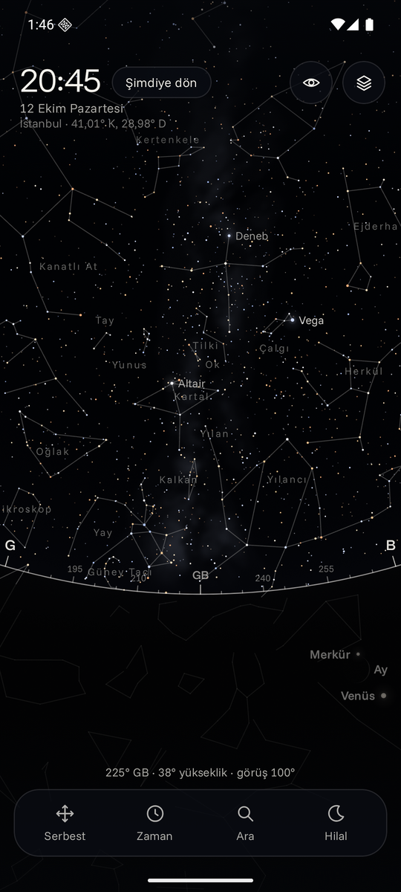
  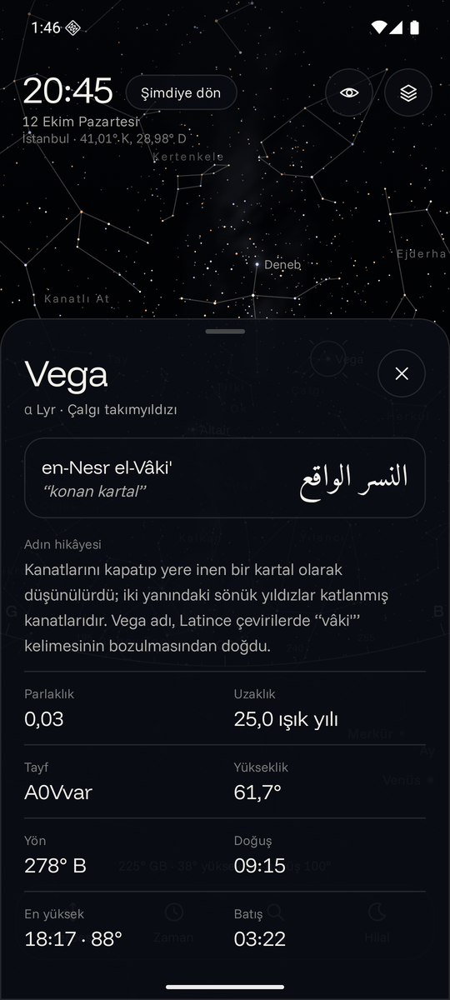
  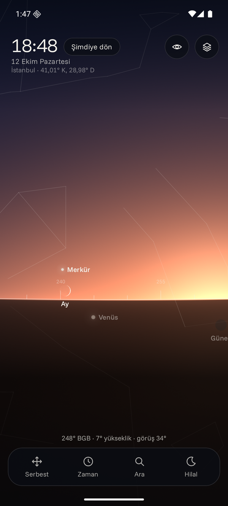
  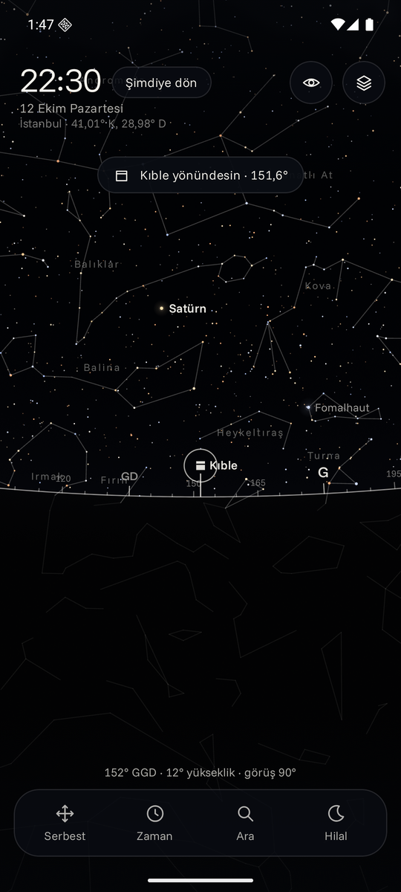
</p>
<p>
  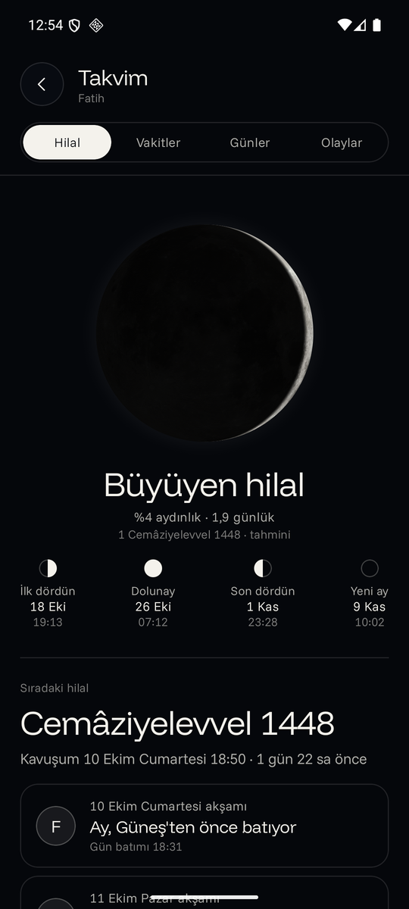
  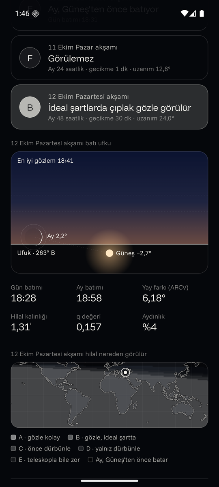
  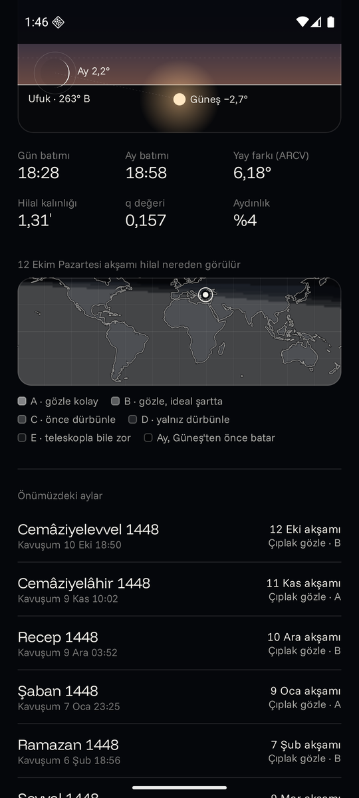
  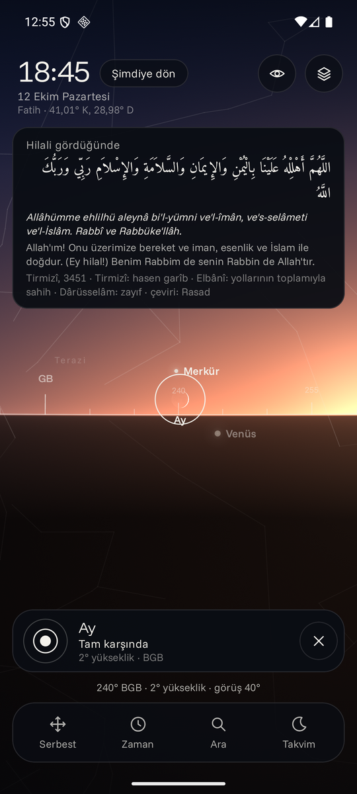
</p>

## Film

<a href="https://github.com/wienerlabs/rasad/releases/download/film-v1/rasad-film.mp4">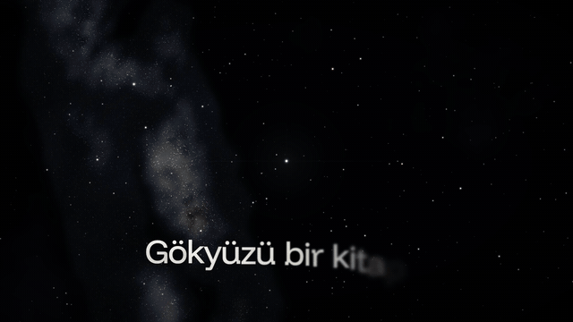</a>

A 56 second, 1080p60 film rendered entirely from code. It uses the app's own star catalog, astrolabe math, Moon lighting and hilal data, with a procedural soundtrack in D Hicaz. [Watch the full film (MP4, 59 MB)](https://github.com/wienerlabs/rasad/releases/download/film-v1/rasad-film.mp4) or read [how it is made](film/README.md).

## What it does

**Live sky**
- Sensor-fused AR view (rotation vector with accelerometer plus magnetometer fallback), magnetic declination corrected with the World Magnetic Model.
- 8,920 stars down to magnitude 6.5, colored by B-V index, sized by magnitude, dimmed by atmospheric extinction and by the actual sky brightness (Sun altitude, moonlight).
- A single AGSL shader renders the atmosphere (day, civil and nautical twilight, night), the Milky Way from a rasterized equirectangular map, the ground, and a photoreal Moon lit by the real Sun direction with the correct phase and bright limb.
- Sun, Moon and all planets from Astronomy Engine; 89 constellation figures with Turkish names; an astrolabe style horizon ring with degree ticks and cardinal points.
- Qibla marker on the horizon with a haptic tick when the phone points at it.
- Time machine: jog dial with hour haptics, day and hour jumps, and a time-lapse mode.
- Night vision mode (full red color matrix) to keep dark adaptation.
- In compass mode the reticle names the constellation you are pointing at.

**Finding things**

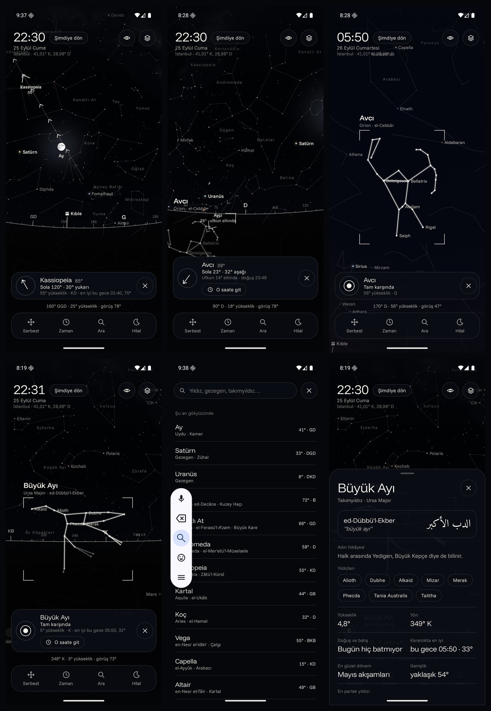

- Search stars, planets and all 88 constellations by Turkish, Latin, classical Arabic or folk name: `simak` finds both Arcturus and Spica, `kepce` finds the Big Dipper, `Ülker` finds Taurus. Every result shows where it is right now, and an empty search opens with what is above the horizon at this moment.
- Guided finding: a great circle path of flowing chevrons runs from the centre of the view to the target, an edge arrow tells how many degrees are left, and a guidance card spells out the turn (`Sola 42° · 18° yukarı`). The phone ticks when the target comes into view and confirms when it is centred.
- A found constellation draws itself in along its lines, gets a frame, its Latin and classical Arabic names and its brightest stars labelled, while the rest of the sky steps back. Flights to a constellation zoom out until the whole figure fits.
- Knows when you cannot see it: a target below the horizon shows its rise time, one that never rises at your latitude says so, and one tap jumps the clock to the best dark moment in the next 24 hours.
- Constellation cards: classical Arabic name with transliteration and meaning, rise, transit and set of the figure, best season, size, brightest star, and tappable member stars.

**Star lore**
- 126 star names with the original Arabic (or Persian and Latin) form set in Amiri, the Ottoman Turkish transliteration, the meaning and a short story: the Sirius verse in Surat an-Najm, the Alcor eyesight test, the daughters of Na'sh in the Big Dipper, Demirkazik for Polaris.
- Names built on "sa'd" (luck) are shown as etymology only, with a note that Islam rejects tying fortune or rain to the stars. A "Yıldızlar ve İslam" note explains the line between using the sky for direction, time and calendar (ilm al-tasyir) and claiming the stars shape events (ilm al-ta'thir), with the verses, Qatada's statement in Bukhari and the hadith qudsi on rain.

**Hilal**
- Lunation: phase, illumination, age, next quarters, Umm al-Qura Hijri date.
- Next conjunction and the Hijri month it opens.
- Three evenings after conjunction evaluated with the Yallop (1997) q test at the best time Tb = Ts + 4/9 Lag, with a western horizon diagram at Tb.
- A world visibility map (A to F zones) for any evening, from a fast grid solver that samples the geocentric Sun and Moon every 10 minutes once and then evaluates 11,041 locations (2 degree grid) in about 0.1 s on a laptop JVM. Unit tests check the fast solver against the detailed per location model.
- Twelve month outlook: for every upcoming month, the first evening the crescent can be seen from your location.
- The month starts with the sighting of the crescent. The hilal tab says where and when to look; it never declares the month.

**Calendar (Takvim)**

The dock opens a calendar with four tabs. Everything in it can be opened in the sky: the clock jumps to the moment and the view turns to it.

<p>
  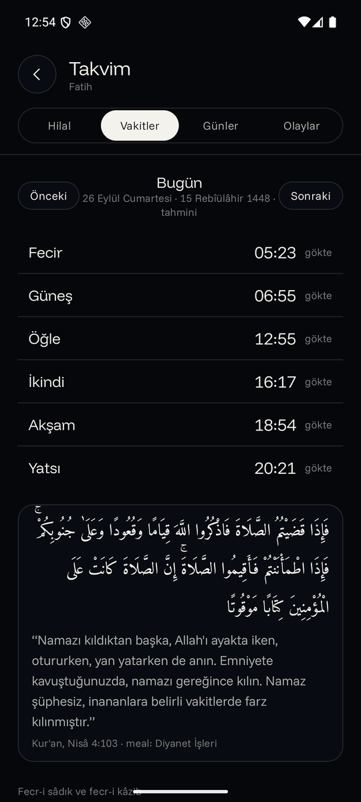
  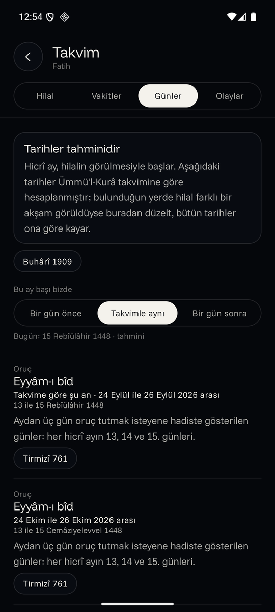
  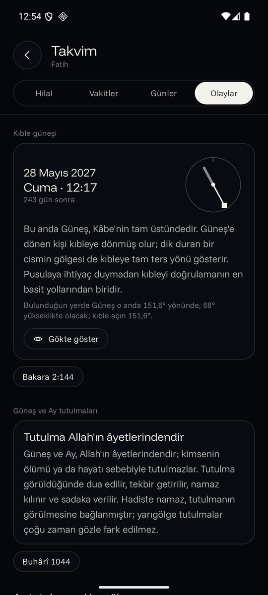
  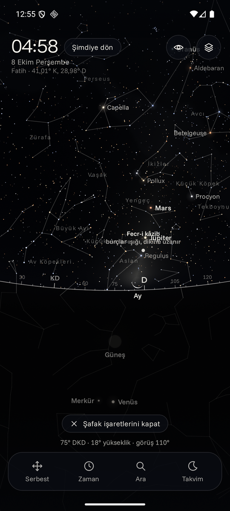
</p>

- Prayer times from the Sun's real position at your location: Diyanet angles (18 and 17 degrees) or Umm al-Qura (18.5 degrees and Isha 90 minutes after Maghrib, 120 in Ramadan); Asr by one shadow length (majority) or two (Hanafi). No precautionary minutes are added.
- True and false dawn: the hadith in Sahih Muslim on the vertical whiteness that does not end the suhur and the spreading one that does. In the sky a dawn guide labels both, and the AGSL shader draws the zodiacal light (the false dawn) as a faint cone along the ecliptic. Moonlight hides it, so the demo jumps to the nearest moonless morning and says so.
- Days with a basis in the Quran or sahih Sunnah only: Ramadan and its last ten nights, the two Eids, six days of Shawwal, the first ten days of Dhul Hijjah, Arafah, the days of Tashriq, Tasu'a and Ashura, the white days (outside Ramadan and Dhul Hijjah, so they never fall on a day of Tashriq), and the four sacred months (with Ibn Hajar's note that no sahih report singles out Rajab). A test checks that no voluntary fast ever overlaps an Eid, a day of Tashriq or Ramadan. Dates follow Umm al-Qura and can be moved one day either way to match the local sighting.
- Qibla sun: the two moments a year when the Sun stands over the Kaaba, with the Sun's direction and height at your location and a shadow dial. The qibla card in the sky offers a jump to the next one.
- Eclipses: every solar and lunar eclipse visible from your location in the next three years, with the Sunnah of the eclipse prayer; penumbral eclipses are flagged as hard to see.
- In the sky: prayer time chips on the time dial, and the hilal du'a card when a young crescent is centred after sunset.
- Every ayah is shown in Arabic (Tanzil simple script, unchanged) with the Diyanet meal; every hadith in Arabic with a Turkish translation, its number and its grading. The texts are cut from verified sources and a unit test keeps them tied to those sources; see [docs/islamic-sources.md](docs/islamic-sources.md).
- Deliberately left out: horoscopes, lucky or unlucky times, lunar mansion divination, kandil, Mawlid, Raghaib and Bara'ah observances, and days whose virtue rests on weak reports. The one text with a disputed grading, the hilal du'a, shows every grading next to it: Tirmidhi hasan gharib, Albani sahih by its routes, Darussalam da'if.

## Architecture

```
app/src/main/java/xyz/wienerlabs/rasad
  astro/     ephemeris wrapper, rise and set, qibla, Yallop, world grid solver, Hijri calendar
  islam/     prayer times, dawn search, qibla sun, local eclipses, sacred days, verified texts
  sky/       catalog loader, camera and stereographic projection, sensor tracker,
             AGSL sky shader, canvas renderer, controller (frame loop, gestures, flights)
  ui/        Compose screens: sky, info sheet, search, time dial, calendar tabs, hilal, map, diagram
  location/  on-device location and reverse geocoding
tools/build_data.py   downloads and compiles the catalogs into compact binary assets
```

The frame loop runs in `withFrameNanos`; the canvas reads a frame counter only in the draw phase, so the sky redraws at display rate without recomposing the UI. Stars are bucketed by magnitude and color and drawn with a handful of `drawPoints` calls.

## Build

Requirements: JDK 17, Android SDK 36.

```bash
./gradlew :app:testDebugUnitTest :app:assembleRelease
```

The release APK is signed with the debug key so it can be sideloaded directly. To rebuild the data assets:

```bash
python3 tools/build_data.py
```

The Islamic texts (`islam/IslamicTexts.kt`), their test fixture and `docs/islamic-sources.md` are generated from the verified source record in `tools/islamic_sources.json`:

```bash
python3 tools/build_islamic_texts.py
```

## Google Play

Release builds are signed with the Play upload key when `keystore.properties` (git-ignored) points to it; the password is read from the macOS Keychain or from `RASAD_UPLOAD_PASSWORD`. Without it they fall back to the debug key. The store listing in Turkish and English, the graphics, the Data safety and content rating answers and the submission steps are in [docs/play-store](docs/play-store/README.md); `python3 tools/build_play_assets.py` regenerates the icon, feature graphics and captioned screenshots from the raw captures.

## Deep links

Useful for demos and for sharing a view:

```
rasad://sky?az=225&alt=38&fov=100&time=2026-10-12T17:45:00Z&lat=41.0082&lon=28.9784&place=Istanbul
rasad://sky?select=Vega
rasad://sky?target=Venus&play=1
rasad://hilal?time=2026-09-25T18:00:00Z
rasad://takvim?tab=vakitler
rasad://takvim?tab=gunler
rasad://takvim?tab=olaylar
```

## Accuracy notes

- Positions come from Astronomy Engine (VSOP87 and a lunar theory accurate to about an arcminute).
- Crescent predictions follow Yallop's method. They are astronomical estimates of where and when to look; the month itself begins with the sighting.
- Hijri dates use the Umm al-Qura calendar (`java.time.chrono.HijrahDate`) with an optional one day local correction.
- Prayer times match an independent solar model within two minutes in the tests; official calendars add a few precautionary minutes that the app does not.
- Eclipse times and visibility come from Astronomy Engine's local solar eclipse search and lunar eclipse search, checked against known 2027 and 2028 events in the tests.

## Data and licenses

See [NOTICE.md](NOTICE.md).
